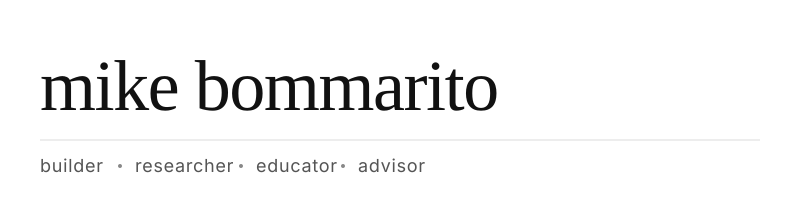

#### what i think about

(ethical) ai · food & agriculture · the legal system · education · open source · data centers and the energy buildout

#### lately

a few things i'm working on or have shipped recently:

- **books** — *the math inside the machine* (how intelligence emerges from eleven simple operations) and *this is server country* (ai, power, and the remaking of rural america). [author page on amazon](https://www.amazon.com/stores/Michael-Bommarito/author/B0GFXQMWXH).
- **[slopython](https://github.com/mjbommar/cpython)** — a "slop" experiment: iteratively evolving cpython with frontier llms to chase performance gains and see what breaks.
- **[linux uml redesign](https://github.com/mjbommar/linux/tree/uml-redesign-plan)** — rebuilding the linux user-mode-linux kernel from scratch, with notes.
- **[glaurung](https://github.com/mjbommar/glaurung)** — a new ghidra. modern, scriptable, less crufty.
- **[nupunkt](https://github.com/alea-institute/nupunkt)** + **[charboundary](https://github.com/alea-institute/charboundary)** — fast, deterministic sentence boundary detection for legal text.
- **[opengloss](https://github.com/mjbommar/opengloss-rs)** — open english lexical knowledge graph (537k senses, 9m semantic edges, generated end-to-end with llms in under a week for less than \$1k).
- **[binary-30k](https://huggingface.co/datasets/mjbommar/binary-30k)** + **[binary-bpe tokenizers](https://github.com/mjbommar/binary-bpe)** — first heterogeneous binary-analysis dataset and tokenizers built for executables.
- **[parallel iliad: brainrot edition](https://michaelbommarito.com/iliad/)** — a parallel greek-english reader of homer's iliad with ai-generated brainrot translations. genuinely useful, also genuinely cursed.
- **[moratorium nation](https://papers.ssrn.com/sol3/papers.cfm?abstract_id=6242898)** — 113-page survey of 116 moratoria across 30 states targeting data centers, solar, wind, and batteries.

#### day "jobs"

- president — [alea institute](https://aleainstitute.ai/) (non-profit; copyright-clean ai for the legal system)
- ceo — [273 ventures](https://273ventures.com/) (legal data infrastructure)
- cto — [licens.io](https://licens.io/)
- ceo — [bommarito consulting](https://bommaritollc.com/)

academic affiliations: codex (stanford), msu college of law (adjunct). past: chicago-kent law lab (head of research), umich complex systems (lecturer).

#### past

ceo, lexpredict (acquired 2018) · plus the lexnlp / openedgar / "gpt takes the bar exam" / network-of-supreme-court / complexity-of-the-u.s.-code work people still cite.

~50 papers, 3,000+ citations across legal informatics, network science, quantitative finance, and ai. *science*, *quantitative finance*, cambridge university press, ssrn, arxiv.

#### recent

<!-- RECENT:START -->

- [june 2026 patch tuesday: a patch-diff campaign](https://michaelbommarito.com/wiki/infosec/june-2026-patch-tuesday-patch-diff) — *blog* · `2026-06-10`
- [glaurung windows driver findings](https://michaelbommarito.com/wiki/infosec/glaurung-windows-driver-findings) — *blog* · `2026-06-10`
- [ndfltr.sys: a 32-bit offset+length wrap into a kernel OOB read](https://michaelbommarito.com/wiki/infosec/ndfltr-networkdirect-offset-wrap-oob-read) — *blog* · `2026-06-10`
- [NDKPing.sys: a NULL SystemBuffer deref you can blue-screen on demand](https://michaelbommarito.com/wiki/infosec/ndkping-null-deref-dos) — *blog* · `2026-06-10`
- [ctrl-F-ing around: how glaurung autonomously discovered a heap overflow in notepad.exe](https://michaelbommarito.com/blog/reading-all-of-notepad-with-an-llm) — *blog* · `2026-05-30`
- [chunkloris: per-chunk http amplification](https://michaelbommarito.com/wiki/chunkloris) — *blog* · `2026-05-22`

<!-- RECENT:END -->

#### everything else

bio, blog, wiki, publications, gallery, bookmarks → [michaelbommarito.com](https://michaelbommarito.com/)

[email](mailto:michael.bommarito@gmail.com) · [linkedin](https://www.linkedin.com/in/bommarito/) · [x](https://x.com/mjbommar/) · [scholar](https://scholar.google.com/citations?user=gIDHq_oAAAAJ&hl=en)

---

